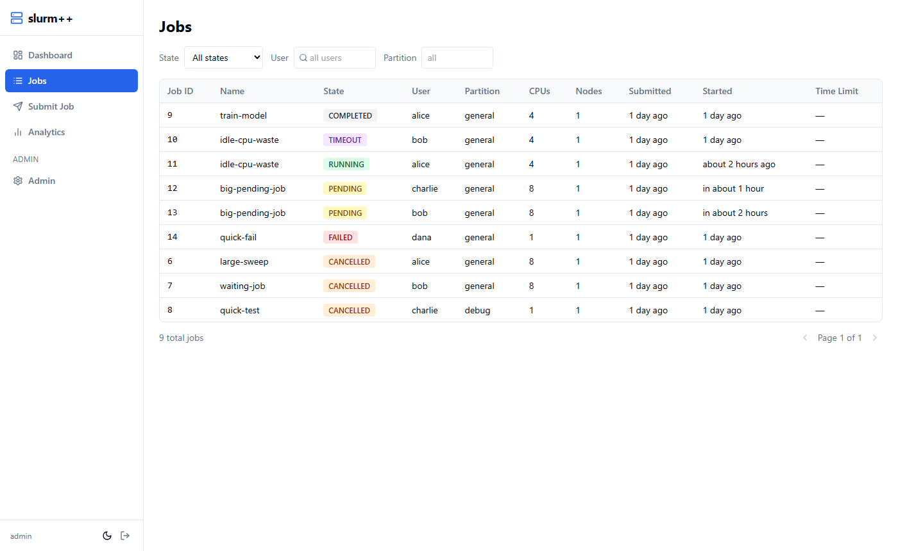
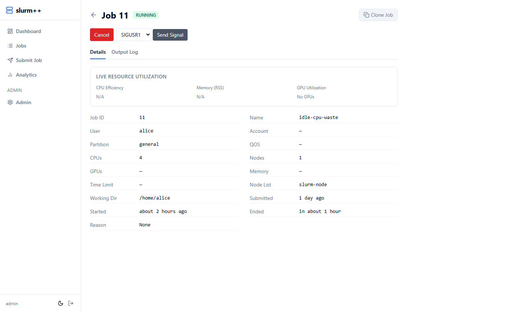
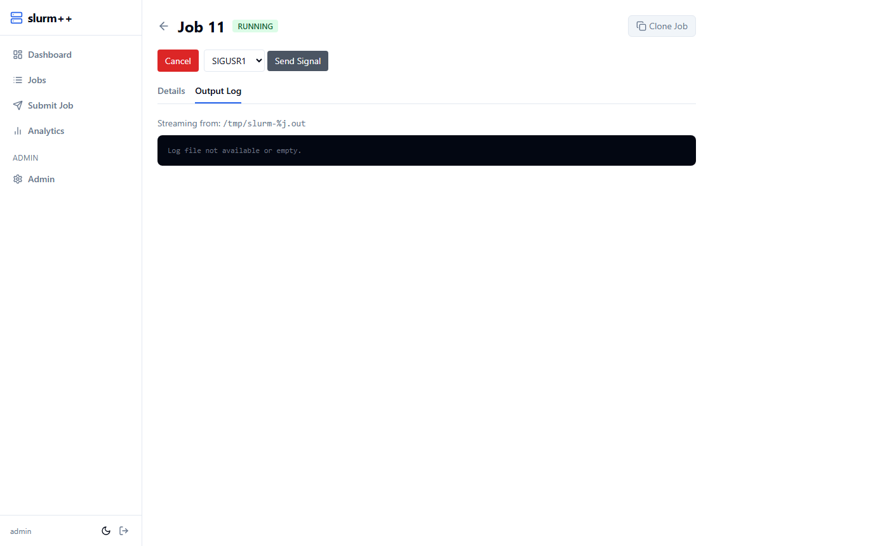
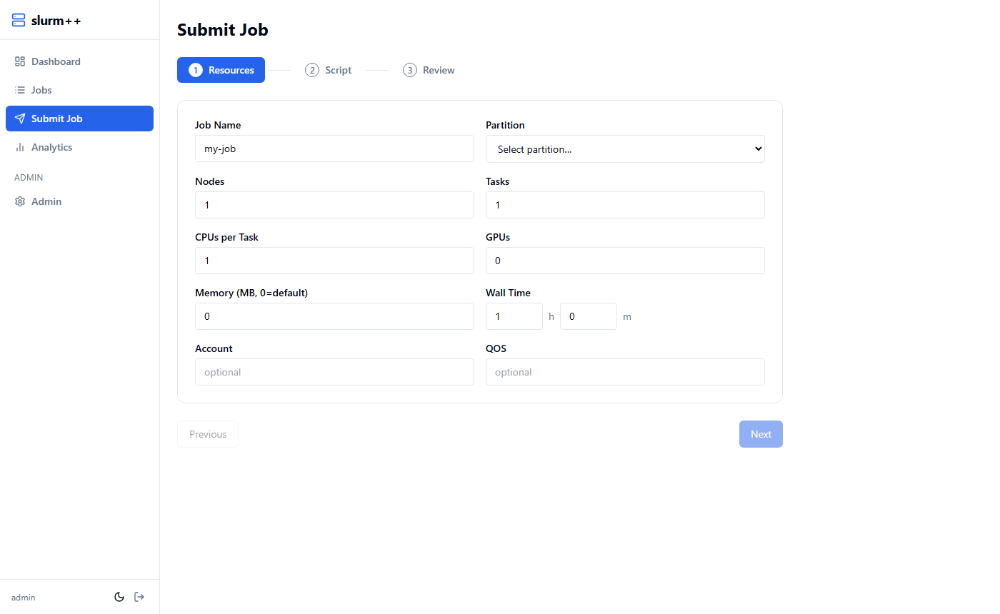
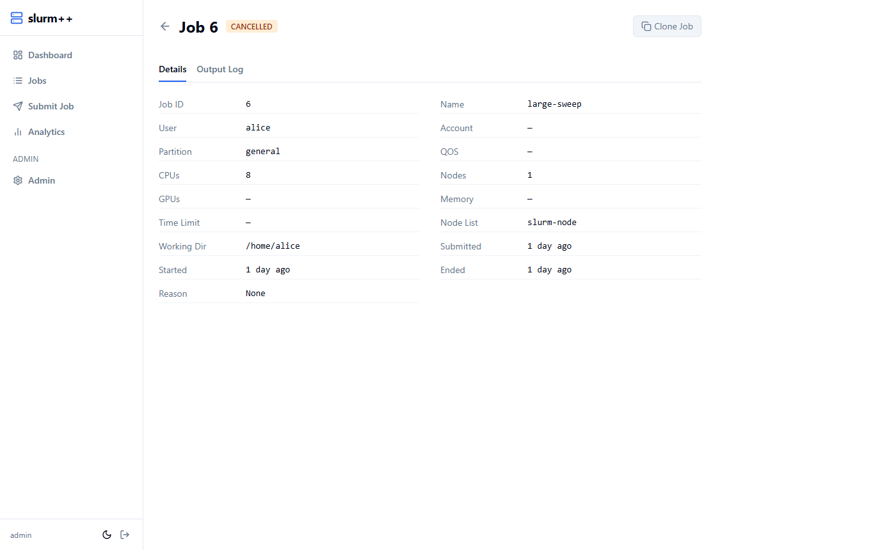
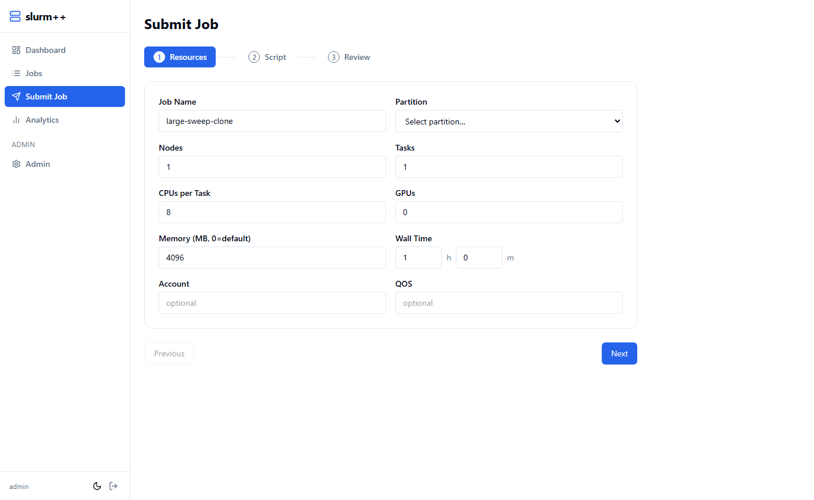
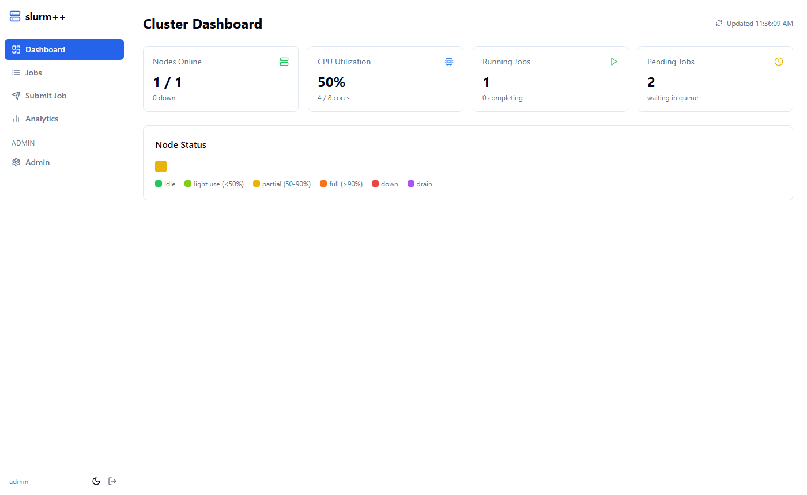
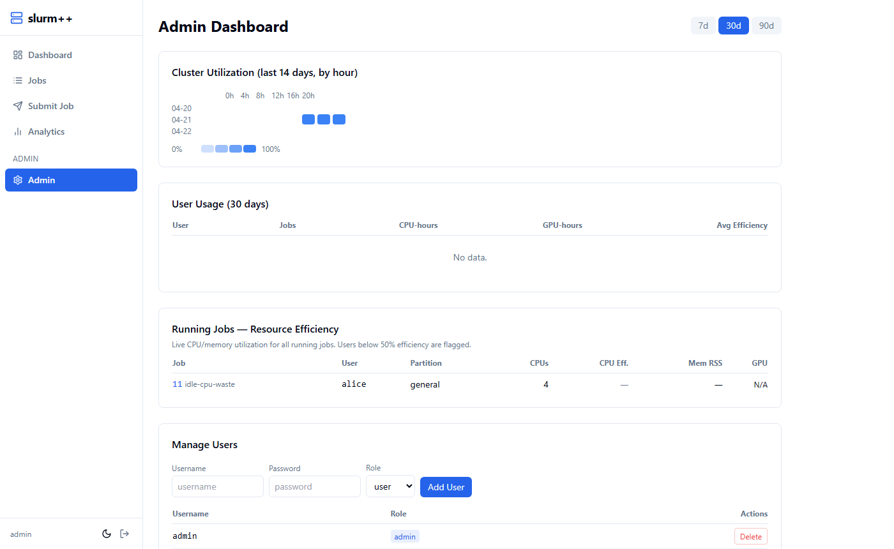

# Slurm++ — Modern HPC Cluster Management Dashboard

**Version:** 0.1 (April 2026)
**Audience:** Engineering and Research Platform Teams
**Status:** Internal Preview

---

## Table of Contents

1. [The Problem](#1-the-problem)
2. [Why Existing Tools Fall Short](#2-why-existing-tools-fall-short)
3. [What Slurm++ Solves](#3-what-slurm-solves)
4. [Features Overview](#4-features-overview)
5. [Architecture](#5-architecture)
6. [Deployment](#6-deployment)
7. [Roadmap](#7-roadmap)

---

## 1. The Problem

High-performance computing (HPC) clusters running [Slurm Workload Manager](https://slurm.schedmd.com/) are the backbone of most large-scale research and ML infrastructure. Thousands of jobs run daily — training models, processing data, running simulations — yet the tools researchers and platform teams use to interact with these clusters have barely changed in 20 years.

The day-to-day reality for most cluster users looks like this:

```bash
# Is my job running?
squeue -u alice

# Why is it pending?
squeue -j 12345 --format="%.18i %.9P %.8j %.8u %.8T %.10M %.9l %.6D %R"

# How much memory did it use?
sacct -j 12345 --format=JobID,MaxRSS,AveCPU,Elapsed

# What's happening across the whole cluster?
sinfo -o "%n %e %m %a %c %C"
```

These commands work, but they require deep familiarity with Slurm's CLI flags, produce cryptic output, and give no real-time visibility into *why* something is slow, failing, or wasting resources.

For platform teams managing shared clusters, the situation is worse. There is no consolidated view of who is using what, which jobs are inefficient, or which nodes are struggling — without running multiple `sacct` queries and manually piecing together the picture.

---

## 2. Why Existing Tools Fall Short

Several commercial and open-source tools exist in this space. None fully address the problem.

| Tool | Type | Gaps |
|---|---|---|
| **squeue / sinfo** | CLI (built-in) | No UI, no history, no context |
| **Slurm-web** | Web UI | Read-only, minimal, unmaintained |
| **Open XDMoD** | Analytics platform | Complex to deploy, no real-time data, no job control |
| **Grafana + Prometheus** | Metrics dashboards | Infrastructure-level only, no Slurm job awareness |
| **Bright Cluster Manager** | Commercial suite | Expensive, overkill for many teams, vendor lock-in |
| **PBS/Altair** | Commercial suite | PBS-specific, not Slurm-native |
| **Jupyter Hub** | Notebook gateway | Submission only, no visibility into cluster state |

**The common gaps across all of these:**

- No per-job resource efficiency tracking (you can't easily see "this job asked for 8 CPUs but only used 1")
- No single place to submit, monitor, cancel, and re-run jobs
- No admin view showing underutilization across the fleet
- Complex deployment requiring root or dedicated infrastructure
- No support for modern auth (LDAP, SSO)

---

## 3. What Slurm++ Solves

Slurm++ is a lightweight, self-hosted web dashboard that sits on top of any existing Slurm cluster. It requires no changes to the cluster itself and can run as an unprivileged service account.

**Core philosophy:**
- Every researcher should be able to use the cluster without knowing a single `squeue` flag
- Platform teams should be able to see inefficiency and intervene before it compounds
- The tool should be deployable in an afternoon, not a sprint

---

## 4. Features Overview

### 4.1 Job Dashboard



The main job view shows all jobs across the cluster with live status updates (polling every 10 seconds). Each job shows:

- State with color coding (green = running, amber = pending, red = failed)
- Owner, partition, resource allocation (CPUs, memory, GPUs)
- Submit time and elapsed/remaining time
- State reason (e.g. *Resources*, *Priority*) so users immediately understand why a job is waiting

**Filtering:** Jobs can be filtered by state, user, or partition. Pagination handles clusters with thousands of jobs.

---

### 4.2 Job Detail & Real-Time Metrics



Clicking any job opens a detail view with:

**For running jobs:**
- **CPU efficiency** — live gauge showing actual vs. allocated CPU usage. Color-coded: green (≥75%), amber (50–75%), red (<50%)
- **Memory RSS** — actual resident memory in MB
- **GPU utilization** — if the job is using GPUs, live utilization percentage
- These metrics update every 10 seconds via the backend's `sstat` integration

**For all jobs:**
- Full job configuration (partition, account, QOS, working directory)
- Standard output and error file paths
- Link to real-time log viewer

---

### 4.3 Real-Time Log Viewer



For running jobs, clicking **View Logs** opens a live-streaming log panel backed by Server-Sent Events (SSE). Logs tail in real time without needing to SSH into the cluster — useful for monitoring training runs, checking for errors mid-job, or confirming a job has started correctly.

---

### 4.4 Job Submission



A guided form for submitting jobs removes the need to write `#SBATCH` headers manually. Fields include:

- Job name, partition, account, QOS
- Number of nodes, CPUs per node, GPUs, memory
- Time limit (hours + minutes picker)
- Script body editor
- Environment variable injection

The form validates inputs before submission and surfaces Slurm errors clearly.

---

### 4.5 Clone Job





Any job — whether completed, failed, or cancelled — can be cloned with one click. The submission form opens pre-filled with the original job's configuration, allowing the user to tweak parameters (e.g. increase memory, change partition) and resubmit immediately.

This is particularly useful when:
- A job failed due to OOM and needs a memory bump
- You want to re-run a sweep with a different hyperparameter
- A colleague ran a job you want to replicate

---

### 4.6 Cluster Dashboard & Node Grid



The cluster node grid gives an at-a-glance view of the entire cluster. Each node is color-coded by utilization:

| Color | Meaning |
|---|---|
| 🟢 **Green** | Idle — no jobs allocated |
| 🟡 **Lime** | Lightly used (1–49% CPU allocated) |
| 🟡 **Yellow** | Partially used (50–89% CPU allocated) |
| 🟠 **Orange** | Mostly full (≥90% CPU allocated) |
| 🔴 **Red** | Down or in error state |
| 🟣 **Purple** | Draining |

Hovering a node shows its name, allocated vs. total CPUs, and memory. This view immediately surfaces hot spots, dead nodes, and opportunities to rebalance workloads.

---

### 4.7 Admin Dashboard



Administrators see an additional dashboard with:

#### Cluster Utilization Heatmap

A 24-hour × 30-day heatmap of CPU utilization across the cluster. Darker cells = higher utilization. This makes it easy to spot:
- Daily usage patterns (peak hours, quiet nights)
- Days where the cluster was underutilized
- Anomalies (sudden drops may indicate node failures)

Data is sampled every 30 seconds by the background poller and aggregated by hour.

#### Low Efficiency Jobs

A live table of currently running jobs with <50% CPU efficiency. This is the single most impactful feature for platform teams — on most shared clusters, 20–40% of allocated CPU-hours are wasted by jobs that request far more resources than they use.

For each inefficient job, admins can:
- See the actual efficiency percentage
- See who owns the job and what it's doing
- Click through to the job detail for context
- (Future) Send an automated efficiency alert to the user

#### User Management

Admins can add and remove dashboard users directly from the UI. When a new user is created:
1. Their account is created in the dashboard database (for login)
2. A Linux user is created on the cluster
3. They are registered in Slurm accounting

On real clusters where user management is handled by LDAP/AD, step 2 and 3 are handled by the identity provider — the dashboard integrates via `AUTH_BACKEND=ldap`.

---

### 4.8 Authentication

Slurm++ supports two authentication backends:

- **Local** (default for demo): username/password stored with bcrypt hashing
- **LDAP**: Bind against an Active Directory or OpenLDAP server using existing cluster credentials — researchers log in with the same username/password they use for SSH

Role-based access control separates regular users (can see and manage their own jobs) from admins (can see all jobs, access admin dashboard).

---

## 5. Architecture

```
┌─────────────────────────────────────────────────────────┐
│                     Browser                             │
│         React + TanStack Query + Tailwind CSS           │
└────────────────────────┬────────────────────────────────┘
                         │ HTTPS
┌────────────────────────▼────────────────────────────────┐
│                   nginx (reverse proxy)                 │
│         /api/* → backend    /* → frontend static        │
└──────────┬─────────────────────────────────────────────┘
           │
┌──────────▼──────────────────────────────────────────────┐
│              FastAPI Backend (Python 3.12)               │
│                                                         │
│  ┌─────────────┐  ┌──────────────┐  ┌───────────────┐  │
│  │  REST API   │  │  Poller      │  │  Auth Service │  │
│  │  /api/v1/*  │  │  10s / 30s   │  │  JWT + LDAP   │  │
│  └──────┬──────┘  └──────┬───────┘  └───────────────┘  │
│         │                │                              │
│  ┌──────▼────────────────▼──────────────────────────┐   │
│  │              SQLite (aiosqlite)                   │   │
│  │    JobSnapshot · NodeSnapshot · NodeUtilization   │   │
│  └───────────────────────────────────────────────────┘  │
│                                                         │
│  ┌───────────────────────────────────────────────────┐  │
│  │           Slurm Adapter (pluggable)               │  │
│  │  cli (squeue/sbatch/sacct)  ·  rest (slurmrestd)  │  │
│  └───────────────────────┬───────────────────────────┘  │
└──────────────────────────┼──────────────────────────────┘
                           │ Munge-authenticated Slurm RPC
┌──────────────────────────▼──────────────────────────────┐
│                  Slurm Cluster                          │
│            slurmctld · slurmd · munged                  │
└─────────────────────────────────────────────────────────┘
```

**Key design decisions:**

- **SQLite for persistence** — zero-ops, portable, sufficient for clusters up to ~10k jobs/day. Swap to PostgreSQL by changing `DATABASE_URL`.
- **Polling, not hooks** — doesn't require any Slurm plugin or prolog/epilog changes. Works with any Slurm version ≥ 20.
- **Pluggable Slurm adapter** — `SLURM_INTERFACE=cli` uses subprocess calls (works anywhere with Slurm CLI tools). `SLURM_INTERFACE=rest` uses the Slurm REST API for per-user job submission without `sudo`.
- **SSE for logs** — real-time log streaming via Server-Sent Events avoids WebSocket complexity while still being reactive.

---

## 6. Deployment

### Demo (Docker Compose)

The fastest way to try Slurm++ is the included demo stack, which spins up a real single-node Slurm cluster alongside the dashboard:

```bash
git clone <repo>
cd slurm++/demo
docker compose -f docker-compose.demo.yml up -d
# Dashboard at http://localhost:8080
# Login: admin / admin
```

The demo cluster comes pre-seeded with jobs across all states so every feature is immediately exercisable.

### Real Cluster (No Root Required)

For production use on an existing cluster:

```bash
# 1. Create a service account (one-time, needs sysadmin)
sudo useradd -m slurmpp-svc

# 2. Install the backend (no root)
git clone <repo>
cd slurm++/backend
python3 -m venv .venv && source .venv/bin/activate
pip install -r requirements.txt

# 3. Configure
export DATABASE_URL=sqlite+aiosqlite:////data/slurmpp.db
export SLURM_INTERFACE=cli         # or 'rest' if slurmrestd is available
export AUTH_BACKEND=ldap
export LDAP_URL=ldaps://ldap.yourcluster.edu
export JWT_SECRET_KEY=$(openssl rand -hex 32)

# 4. Run
uvicorn app.main:app --host 0.0.0.0 --port 8000

# 5. Build and serve the frontend
cd ../frontend
npm run build
# Serve dist/ behind nginx pointing /api/* to backend
```

### Environment Variables

| Variable | Default | Description |
|---|---|---|
| `SLURM_INTERFACE` | `cli` | `cli`, `rest`, or `mock` |
| `AUTH_BACKEND` | `local` | `local` or `ldap` |
| `DATABASE_URL` | SQLite | Any SQLAlchemy-compatible URL |
| `JWT_SECRET_KEY` | — | Required in production |
| `LDAP_URL` | — | LDAP server URL |
| `LDAP_BASE_DN` | — | e.g. `dc=cluster,dc=example,dc=com` |
| `POLL_JOBS_INTERVAL` | `10` | Seconds between job polls |
| `POLL_NODES_INTERVAL` | `30` | Seconds between node polls |

---

## 7. Roadmap

### Near-term (next 1–2 months)

| Feature | Description | Value |
|---|---|---|
| **Slurmrestd integration** | Use Slurm's native REST API for per-user job submission (no sudo) | Production-ready job submission |
| **Email / Slack alerts** | Notify users when their job fails, or when efficiency drops below threshold | Reduces wasted cycles |
| **Job templates** | Save and re-use job configurations | Faster iteration for researchers |
| **Array job visualization** | Show progress of job arrays (e.g. 847/1000 tasks done) | Common ML sweep use case |
| **GPU node detail** | Show per-GPU memory and utilization for GPU nodes | Critical for DL teams |

### Medium-term (2–6 months)

| Feature | Description | Value |
|---|---|---|
| **PostgreSQL support** | Production-grade persistence for large clusters | Scales to 100k+ jobs/day |
| **Multi-cluster view** | Aggregate across multiple Slurm clusters in one dashboard | Federated infrastructure teams |
| **SSO (SAML/OIDC)** | Integrate with institutional identity providers (Okta, Azure AD) | Enterprise deployment |
| **Cost attribution** | Map CPU/GPU hours to teams, projects, grants | Chargeback and planning |
| **Reservation management** | View and create Slurm reservations from the UI | Planned maintenance windows |
| **Fair-share visualization** | Show each group's share usage and decay | Helps users understand priority |

### Longer-term

| Feature | Description | Value |
|---|---|---|
| **Predictive queue time** | ML model estimating when a pending job will start | Better planning for researchers |
| **Anomaly detection** | Flag jobs with unusual resource patterns automatically | Proactive efficiency management |
| **Workflow / DAG support** | Submit multi-step pipelines with dependencies | Replaces ad-hoc shell orchestration |
| **Mobile app** | Check job status from phone | Quick status checks on the go |
| **Kubernetes bridge** | Run overflow jobs on K8s when Slurm is busy | Hybrid compute environments |

---

## Appendix: Competitive Summary

| Capability | Slurm++ | squeue CLI | Slurm-web | Open XDMoD | Bright CM |
|---|:---:|:---:|:---:|:---:|:---:|
| Real-time job list | ✅ | ✅ | ✅ | ❌ | ✅ |
| Per-job CPU/mem efficiency | ✅ | ⚠️ manual | ❌ | ✅ | ✅ |
| Node utilization heatmap | ✅ | ❌ | ❌ | ✅ | ✅ |
| Job submission UI | ✅ | ❌ | ❌ | ❌ | ✅ |
| Job cloning | ✅ | ❌ | ❌ | ❌ | ❌ |
| Real-time log streaming | ✅ | ❌ | ❌ | ❌ | ✅ |
| Admin efficiency view | ✅ | ❌ | ❌ | ✅ | ✅ |
| LDAP / SSO auth | ✅ | N/A | ❌ | ✅ | ✅ |
| Deploys without root | ✅ | N/A | ✅ | ❌ | ❌ |
| Open source | ✅ | ✅ | ✅ | ✅ | ❌ |
| Setup time | ~1 hr | 0 | ~1 day | ~1 week | ~1 month |

---

*Slurm++ is under active development. Contributions and feedback welcome.*
